# Background
Suicide rates in the United States have steadily increased over the past 18 years. I use data from the CDC Wonder compressed mortality database.
Driving Question: What factors can be observed within national suicide data that would help develop a predictive model?
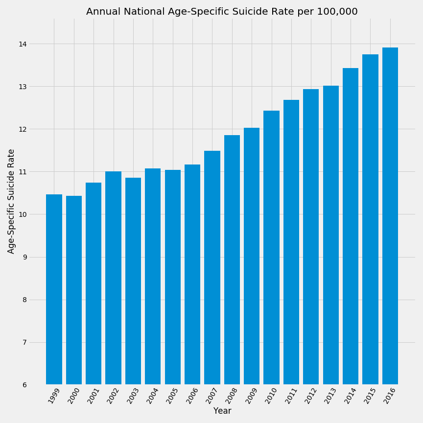

### Raw Data
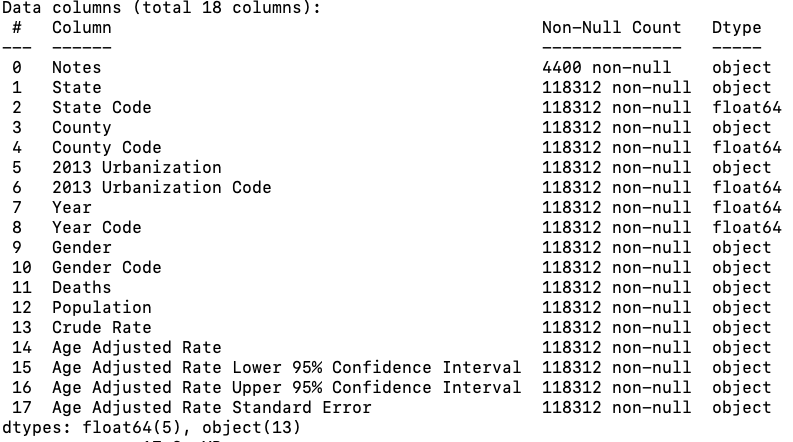
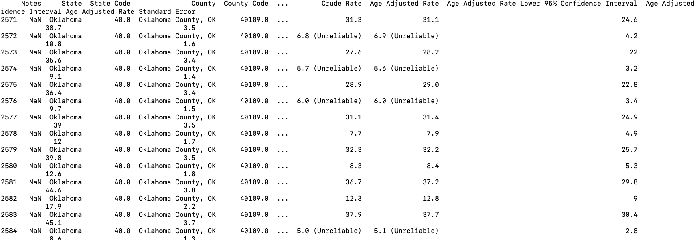

# Data
In analyzing my data I used two different rates provided by the datasets. When looking at National level data I used the Age-Specific rate. Whereas when comparing counties to each other I used the Age-Adjusted rate.  I chose to use the Age-Adjusted rate to normalize my data in terms of counties’ population having different age group rates.
Example of how Age-Adjusted Rates are calculated from New Jersey Department of Health:
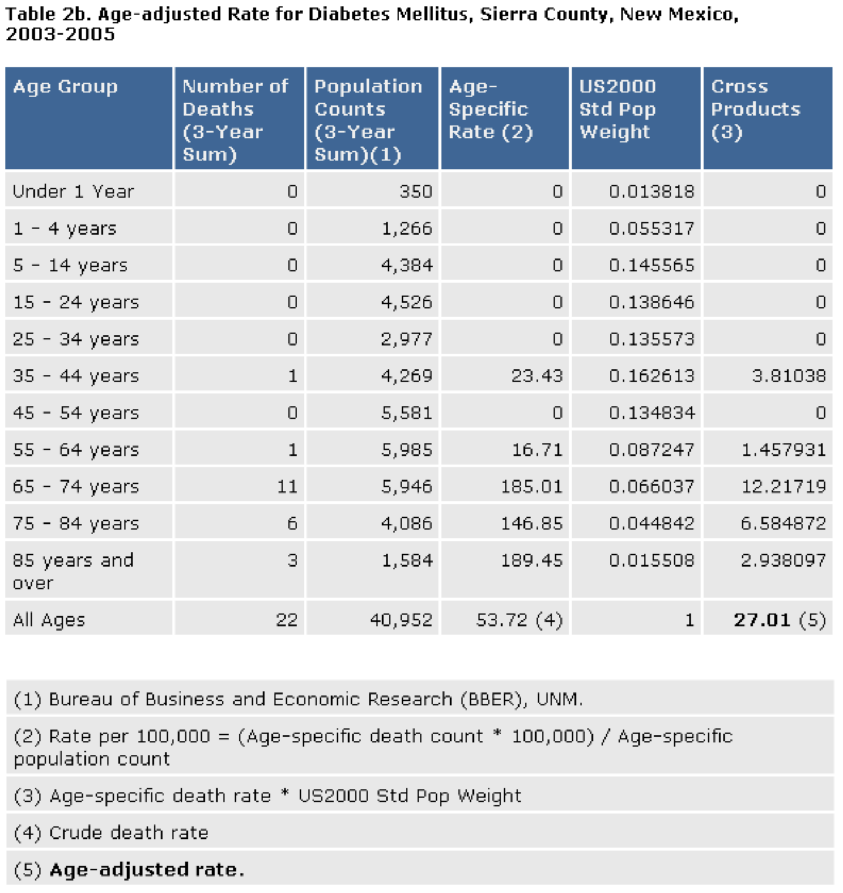

## Two Approaches to looking for meaning
### Male vs Female Suicide rates
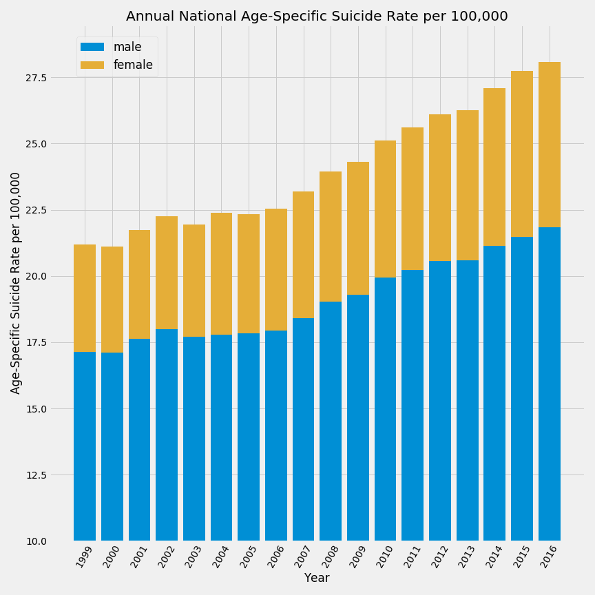

### County Urbanization Classification
The National Center for Health Statistics 2013 Urban-Rural classification scheme groups counties in the following six categories by population

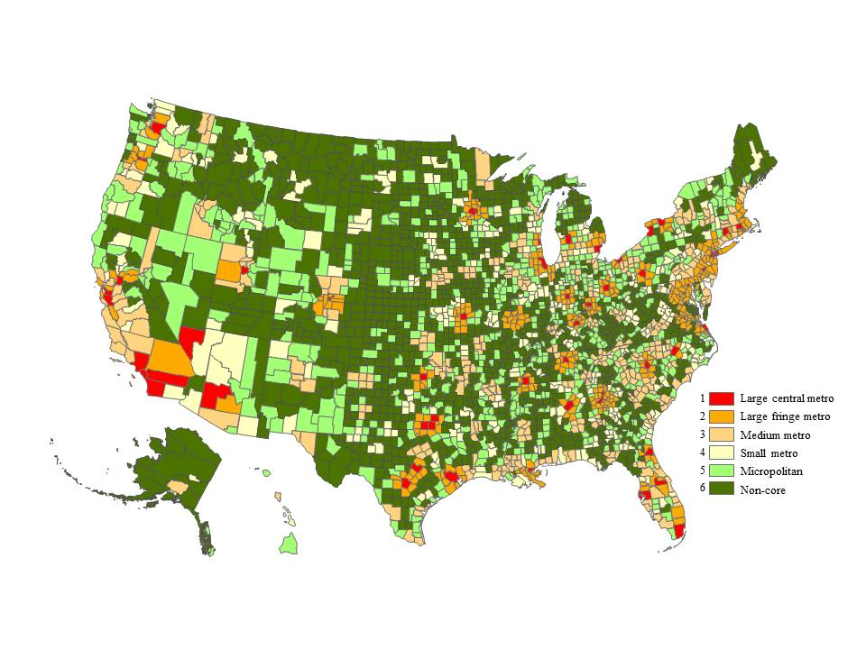

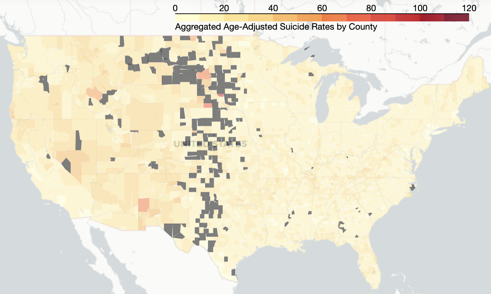
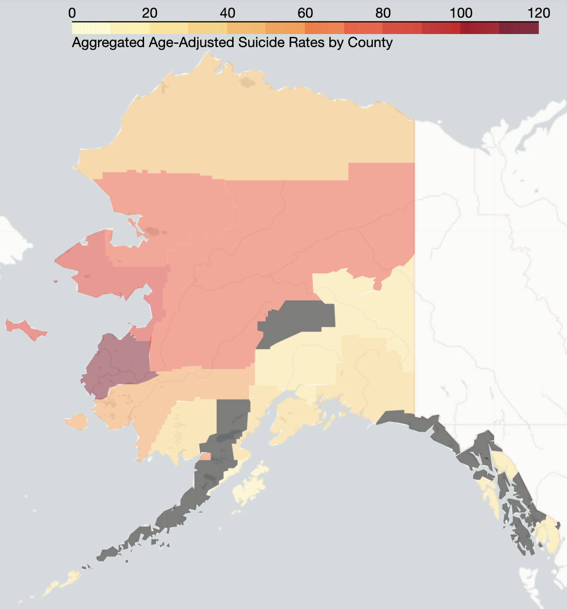

# Statistics

I set my significance level to 0.05 with the intention of doing a Bonferroni correction.

### Male vs Female
Null Hypothesis: "The national male suicide rate average will equal the national female suicide rate average."

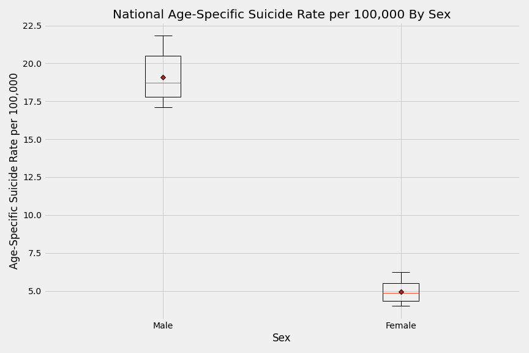

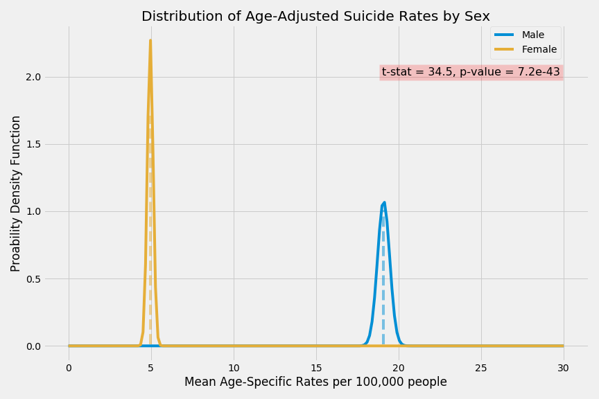

### Urbanization Areas
Null Hypothesis: "The average suicide rate in metropolitan areas will be equal to the average suicide rate in non-metropolitan areas."

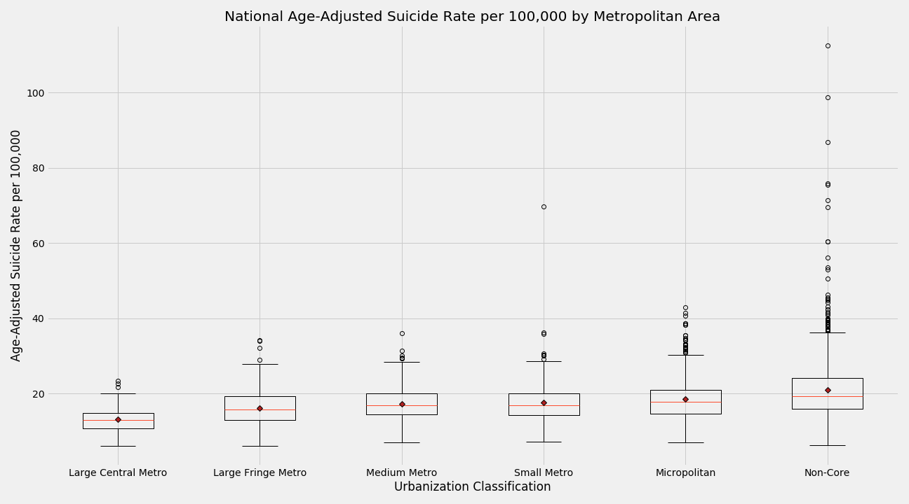

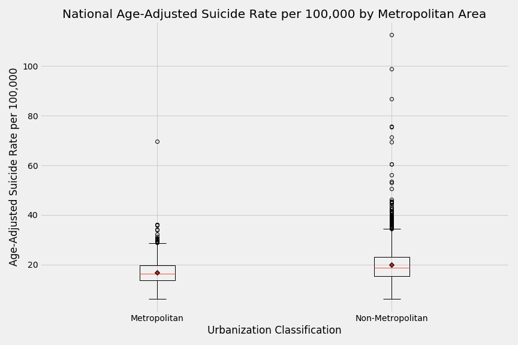

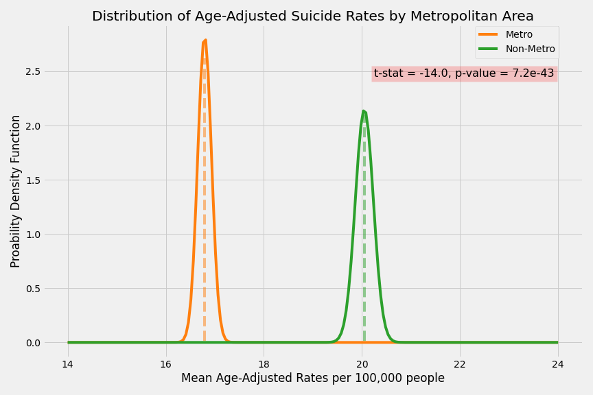

#### Bonferroni Correction
* Male vs Female T-Test p-value: 8.1e-22
* Metropolitan vs Non-Metro T-Test p-value: 1.4e-42
* Corrected alpha 0.025