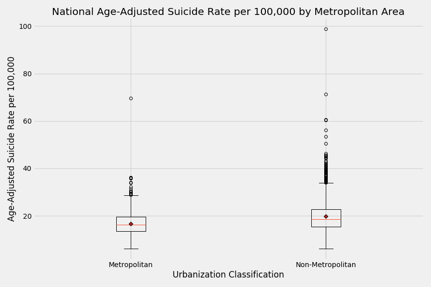
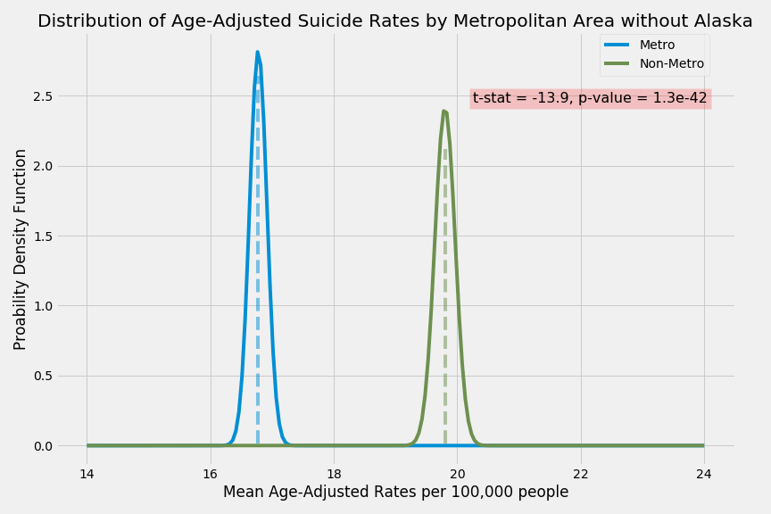

# Background
Suicide rates in the United States have steadily increased over the past 18 years. I use data from the CDC Wonder compressed mortality database.
 
**Driving Question:** What factors can be observed within national suicide data that would help develop strong story points that can be visualized graphically?

 
<kbd>Note: y-axis starts at a rate of 6 suicides per 100,000</kbd>

## Raw Data

County Level Info              | County Level Snapshot
:-----------------------------:|:-----------------------------:
  |  
 
 
 

---
 

In analyzing my data, I used two different rates provided by the datasets. When looking at National level data I used the Age-Specific rate. Whereas when comparing counties to each other, I used the Age-Adjusted rate.  I chose to use the Age-Adjusted rate to normalize my data in terms of counties’ population having different age group rates.

 

<kbd>Example of how Age-Adjusted Rates are calculated for Diabetes Mellitus, courtesy of New Jersey Department of Health:</kbd>

 
 

---
 
 

# Data Dive

 
 

## Two Approaches on the Data
### Male vs Female Suicide rates
When thinking about larger scale trends, I first looked into the annual Age-Specific rates for Males and Females within the United States. Looking at the data for the years given, there was an immediate visual difference between the rates. 

 
<kbd>Note: y-axis starts at a rate of 10 suicides per 100,000</kbd>

---

### County Urbanization Classification
My second approach to the data was to use the Age-Adjusted suicide rates for the counties to see if there was a difference between types of urban classifications. I used the CDC's National Center for Health Statistics (NCHS) 2013 Urban-Rural classification scheme to categorize the counties.

<kbd>2013 NCHS Urban-Rural classification scheme for counties:</kbd>

#### Examples of each type of county:
1. Large Central Metro - Denver County
1. Large Fringe Metro - Arapahoe County
1. Medium Metro - Boulder County
1. Small Metro - Pueblo County
1. Micropolitan - Summit County
1. Non-Core - Gunnison County

 
 

<kbd>United States counties by urbanization codes:</kbd>

 

 

<kbd>United States counties by aggregate age-adjusted suicide rate:</kbd>

 
 

<kbd> Alaskan counties by aggregate age-adjusted suicide rate:</kbd>
 
 

 
 

 
 

---

 
 
Seeing how much of the higher rates were concentrated in Alaska, I filled in the rates based just on the range seen within the continental United States. 

County Urbanization Codes      | Continental Counties Suicide Rates
:-----------------------------:|:-----------------------------:
  |  
 
 

 
 

---

# Statistics

I set my significance level to 0.05 and did a Bonferroni Correction after I ran my tests.
I ran T-Tests comparing the rates of Male vs Female suicide, and Metropolitan vs Non-Metropolitan County suicide. 

### Male vs Female
**Null Hypothesis: "The national male suicide rate average will be equal to the national female suicide rate average."**

 

 
 

---

### Metropolitan vs Non-Metropolitan Counties
**Null Hypothesis: "The average suicide rate in metropolitan areas will be equal to the average suicide rate in non-metropolitan areas."**
 
 
First, I visualized each of the six different county classification codes by the age-adjusted rates. What stood out to me was the outliers seen in the Non-Core classification. This was in line with what what I was seeing on my mapping with the counties in Alaska.  
 

 

Next, I combined the four metropolitan codes (1-4) and the two non-metropolitan codes (5 & 6) to visualize the data before I ran my t-test.

 

 

 

---

Thinking about outliers, my thoughts immediately went to how Alaska looked on the map. I decided to re-run my tests excluding the data from Alaska to see if there was a difference between the Metropolitan and Non-metropolitan counties in the continental United States.

 

 

 

#### Bonferroni Correction
* Male vs Female T-Test p-value: **1.2e-21**
* Metropolitan vs Non-Metro T-Test p-value: **2.1e-42**
* Metropolitan vs Non-Metro (No Alaska) T-Test p-value: **3.9e-42**
* Corrected alpha **0.017**

I rejected all my null hypothesis.

 

---

 

## Next Steps
* Analyze the mechanisms used to commit suicide
* Analyze the distribution of the age-groups committing suicide
* Create an interactive display that would allow user to:
    * Display the change in county level data over time
    * Zoom in on specific states
* Add county economic data to county age-adjusted rates and run KMeans to look for different ways to groups counties
    